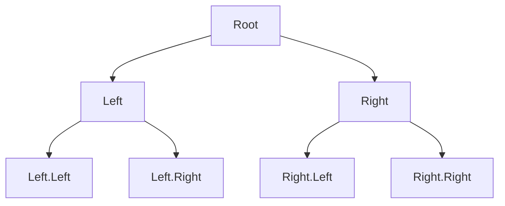
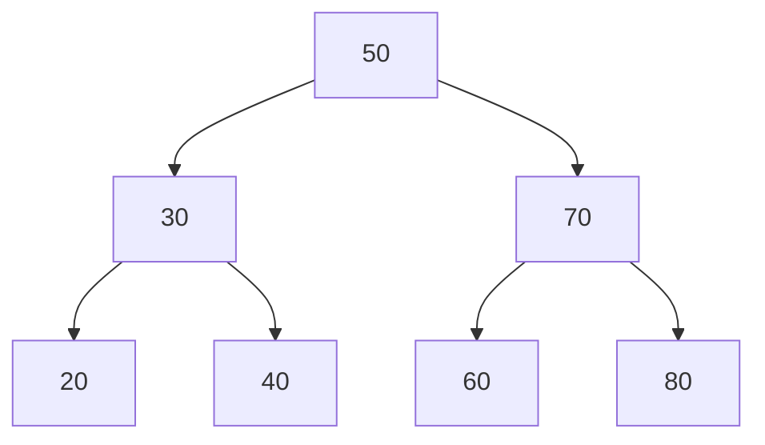
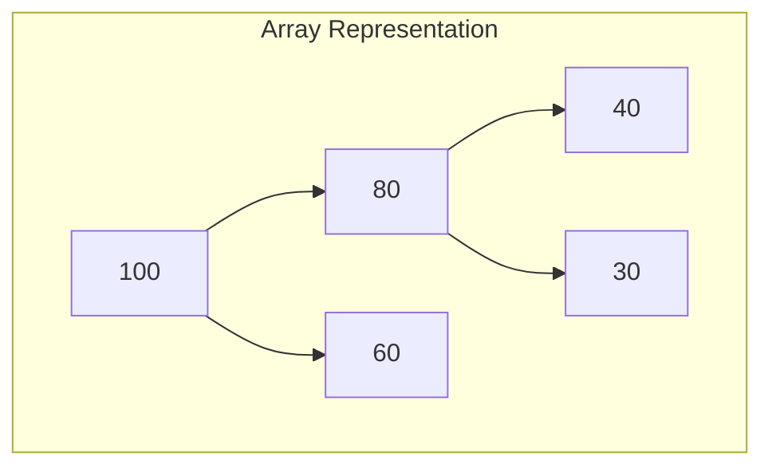
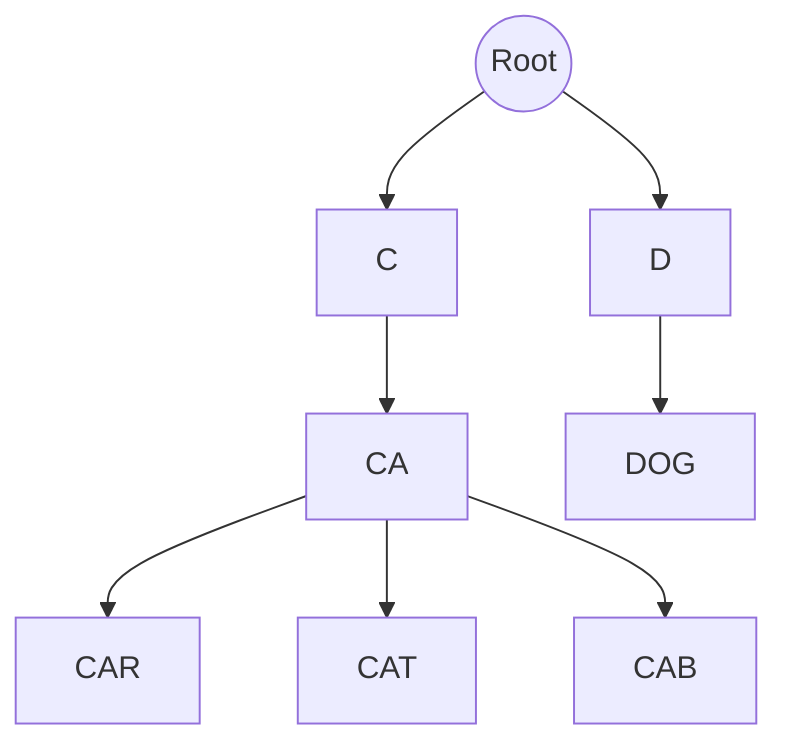
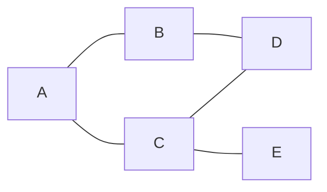

# AI BUILDER — MODULE 3 (Assessment Prep Edition)

## Data Structures: From Foundations to Assessment Ready

This version is written so a complete beginner can follow every explanation, while still going deep enough for someone preparing for a computational thinking and applied AI skills assessment. Every section follows the same pattern:

1. Plain language explanation (what it is, why it exists)
2. How it works, with a diagram or visual
3. Working code you can run
4. Practice questions: Basic first, then Intermediate/Interview style, each one followed immediately by a full answer, so you also see how to think through it, not just what to say

Estimated study time: 10 to 14 hours. Work through it in order. Try answering each question yourself before reading the answer underneath it, that is the part that actually prepares you for the assessment.

---

## Table of Contents
- Part 1: Linear structures (Arrays, Dynamic Arrays, Linked Lists, Strings)
- Part 2: Specialized structures (Stack, Queue, Deque, Priority Queue, Hash Table, Set)
- Part 3: Nonlinear structures (Trees, BST, Heaps, Tries, Graphs, BFS/DFS)
- Part 4: Choosing structures, Big O, and interview patterns
- Appendix: Quick reference cheatsheet

---

# PART 1: LINEAR DATA STRUCTURES

## 1. What is a Data Structure?

Think of a data structure as a storage strategy. You have data (numbers, names, records) and you need somewhere to keep it so you can find it, change it, or remove it later. The structure you pick decides how fast each of those actions will be.

Two things always matter:
- How the data sits in memory (in a row, scattered with links, in a hierarchy)
- What you plan to do with it most often (search, insert, delete, sort)

**Golden rule for assessments:** before naming a structure, first say out loud what operations matter (search, insert, delete, order, size). Then pick the structure that makes the most frequent operation cheap.

### Practice Questions

**Basic**

1. What are the two things you should think about before choosing a data structure?

**Answer:** How the data will be laid out in memory, and which operations (search, insert, delete, ordering) you will perform most often. The second one usually drives the decision.

2. True or false: the same data can be stored using more than one type of structure.

**Answer:** True. For example, a set of usernames could be stored as a list, a set, or a dictionary. The right choice depends on what operations you need to be fast.

**Intermediate / Interview style**

1. Someone gives you a list of one million usernames and says "I need to check if a username already exists, thousands of times per second." Which structure would you reach for first, and why?

**Answer:** A hash set (or hash table if you also need to attach data to each username). Membership checks in a set are O(1) on average, versus O(n) for scanning a plain list, which would be far too slow at that scale and frequency. State this reasoning explicitly in an interview: name the operation (membership check), name its frequency, then match it to the structure with the cheapest cost for that operation.

2. Someone says "I need to keep a running record of the last 5 actions a user took, in order." What would you ask them before choosing a structure?

**Answer:** Ask whether old actions should be automatically dropped once a 6th one arrives (a fixed size queue or deque fits this), whether you need to search inside the history, and whether order matters for display. If it is a strict "keep only the last 5, oldest drops off," a `collections.deque(maxlen=5)` in Python is a clean fit because it handles the eviction automatically.

---

## 2. Arrays

An array is a straight row of boxes in memory, placed right next to each other, all the same size.

```
Index:    0    1    2    3    4
Contents: 12 | 25 | 18 | 40 | 90
```

Because the boxes are side by side, the computer can jump straight to any box if it knows the index. That is why reading by index is instant, no matter how big the array is.

**Costs to remember**
- Read by index: O(1), instant
- Write by index: O(1), instant
- Insert in the middle: O(n), everything after has to shift over to make room
- Delete in the middle: O(n), everything after has to shift back to close the gap

**Example: inserting 15 at index 1 of [10, 20, 30]**
```
Before:  [10, 20, 30]
Shift:   [10,  _, 20, 30]
After:   [10, 15, 20, 30]
```

```python
arr = [10, 20, 30]
arr.insert(1, 15)  # [10, 15, 20, 30]
```

### Practice Questions

**Basic**

1. Why is reading arr[5000] just as fast as reading arr[0]?

**Answer:** Because the computer calculates the exact memory address directly using the formula start address plus (index times element size). It does not need to walk through the earlier elements, so the position of the index does not change the speed.

2. What is the cost of inserting an element at the front of an array, and why?

**Answer:** O(n). Every single existing element has to shift one position to the right to make room for the new first element.

3. Given [3, 7, 9, 12], what is the array after deleting the element at index 1?

**Answer:** [3, 9, 12]. The value 7 is removed, and everything after it (9 and 12) shifts one position to the left to close the gap.

**Intermediate / Interview style**

1. You are given an array where each element points to another index in the same array (like a chain). How would you detect if the chain loops back on itself?

**Answer:** Use Floyd's cycle detection (the tortoise and hare technique): move one pointer one step at a time and a second pointer two steps at a time, both starting at the same position. If there is a cycle, the fast pointer will eventually meet the slow pointer again. If the fast pointer reaches the end of the array (a null/out of bounds index) instead, there is no cycle. This runs in O(n) time and O(1) extra space, which is why it is preferred over using a visited set (which would also work, but uses O(n) space).

2. Why do interviewers often ask you to state the time complexity of insert and delete for arrays specifically, rather than just read and write?

**Answer:** Because read and write are always O(1) for arrays and rarely reveal understanding. Insert and delete are the operations where the "contiguous memory" tradeoff actually shows up (the need to shift elements), so asking about them tests whether you understand why arrays are fast for some things and slow for others.

3. Design a simple key value store for a small number of items using nothing but an array. What is the tradeoff compared to a hash table?

**Answer:** Store (key, value) pairs as tuples in the array, and do a linear scan to find a key. Insert is O(1) if you just append, lookup and delete are O(n) because you must scan for the key. Compared to a hash table, this trades away average O(1) lookup for simplicity and works fine only when the number of items stays small (a few dozen), since the linear scan cost is negligible at that size.

---

## 3. Dynamic Arrays (Python Lists)

A dynamic array looks like a normal array from the outside, but it can grow. When it fills up, it does not squeeze in more room, it allocates a brand new, bigger block of memory (often double the size), copies everything over, then throws away the old block.

**Why this is still considered fast on average**

Most appends are cheap (just drop the new item in the next free box). Every so often, one append is expensive because it triggers a resize and a full copy. When you average the cost across many appends, it comes out to O(1) per append. This is called amortized O(1).

```
Capacity 4: size grows 1 -> 2 -> 3 -> 4
5th append: allocate capacity 8, copy the 4 existing items, then continue cheaply
```

**Common pitfall:** removing from the front of a Python list, or inserting at the front, is O(n) because everything else has to shift. If you need to add or remove from both ends often, use a deque instead (covered in section 8).

```python
import time

def benchmark_appends(limit: int) -> list[tuple[int, float]]:
    values = []
    timings = []
    for number in range(limit):
        start = time.perf_counter()
        values.append(number)
        elapsed = time.perf_counter() - start
        timings.append((number, elapsed))
    return timings

if __name__ == "__main__":
    timings = benchmark_appends(10000)
    slowest = sorted(timings, key=lambda item: item[1], reverse=True)[:5]
    for index, duration in slowest:
        print(f"append #{index}: {duration:.12f} seconds")
```

### Practice Questions

**Basic**

1. What does "amortized O(1)" mean in your own words?

**Answer:** It means that while a few individual operations may be expensive (like a resize), the cost averages out to constant time when you spread it across a large number of operations. So even though not every single append is O(1), the average append is.

2. Why does a Python list sometimes take longer on one particular append than on the ones before it?

**Answer:** Because that particular append triggered a resize: the list ran out of allocated space, so Python had to allocate a new, larger block of memory and copy every existing element into it before adding the new one.

**Intermediate / Interview style**

1. Explain why `list.pop(0)` is slower than `list.pop()` in Python.

**Answer:** `list.pop()` removes the last element, which requires no shifting, so it is O(1). `list.pop(0)` removes the first element, which forces every remaining element to shift one position to the left to close the gap, making it O(n).

2. If you know in advance that you will store exactly 10000 items and never resize, is there any benefit to preallocating the list versus growing it one item at a time?

**Answer:** Yes, slightly. Preallocating (for example, `[None] * 10000` and filling by index) avoids all the intermediate resize and copy operations that would otherwise happen as the list grows. In practice, for 10000 items this difference is usually negligible unless you are in a tight performance sensitive loop, but the reasoning is: you remove the amortized cost entirely because you never trigger a resize.

3. A dynamic array doubles in size each time it resizes. Roughly how many resizes happen while growing from 0 to 1,000,000 elements? What does that tell you about why doubling keeps things efficient?

**Answer:** Roughly log base 2 of 1,000,000, which is about 20 resizes. That is a tiny number of expensive operations compared to a million cheap appends, which is exactly why the amortized cost stays O(1): the total copying work across all resizes is proportional to n, so spread across n appends, each append pays a constant share.

---

## 4. Linked Lists

A linked list is made of separate nodes scattered anywhere in memory. Each node holds a value and a pointer to the next node (and, for a doubly linked list, a pointer to the previous node too).

```
Singly linked list:
[10] -> [25] -> [40] -> NULL

Doubly linked list node:
[prev | value | next]
```

Because nodes are not sitting next to each other, you cannot jump to "position 5" directly, you must walk from the head, one node at a time. What you gain in exchange: inserting or removing a node, once you already have a reference to it, is O(1), because you are only rewiring a couple of pointers, nothing has to shift.

**Insertion example (insert new node after the first node)**
```
1. new.next = first.next
2. first.next = new
```

**Common beginner mistakes**
- Forgetting to update a pointer, which silently loses a whole chain of nodes
- Losing the head reference by overwriting it before finishing an operation

```python
class Node:
    def __init__(self, value: int) -> None:
        self.value = value
        self.next = None

class LinkedList:
    def __init__(self) -> None:
        self.head = None

    def insert_at_head(self, value: int) -> None:
        new_node = Node(value)
        new_node.next = self.head
        self.head = new_node

    def insert_at_tail(self, value: int) -> None:
        new_node = Node(value)
        if self.head is None:
            self.head = new_node
            return
        current = self.head
        while current.next is not None:
            current = current.next
        current.next = new_node

    def delete_node(self, value: int) -> bool:
        if self.head is None:
            return False
        if self.head.value == value:
            self.head = self.head.next
            return True
        current = self.head
        while current.next is not None and current.next.value != value:
            current = current.next
        if current.next is None:
            return False
        current.next = current.next.next
        return True

    def reverse(self) -> None:
        previous = None
        current = self.head
        while current is not None:
            next_node = current.next
            current.next = previous
            previous = current
            current = next_node
        self.head = previous

    def to_list(self) -> list[int]:
        values = []
        current = self.head
        while current is not None:
            values.append(current.value)
            current = current.next
        return values

if __name__ == "__main__":
    linked_list = LinkedList()
    linked_list.insert_at_head(20)
    linked_list.insert_at_head(10)
    linked_list.insert_at_tail(30)
    linked_list.insert_at_tail(40)
    print(linked_list.to_list())  # [10, 20, 30, 40]
    linked_list.delete_node(20)
    print(linked_list.to_list())  # [10, 30, 40]
    linked_list.reverse()
    print(linked_list.to_list())  # [40, 30, 10]
```

**Reversing a list, the core idea (three pointer walk)**
```python
prev = None
current = head
while current:
    nxt = current.next
    current.next = prev
    prev = current
    current = nxt
head = prev
```

### Practice Questions

**Basic**

1. What is the main advantage of a linked list over an array?

**Answer:** Inserting or removing a node at a known position is O(1), because you only rewire pointers rather than shifting a block of memory. Linked lists also do not need one large contiguous block of memory, so they grow without needing to be resized and copied.

2. What is the main disadvantage of a linked list compared to an array?

**Answer:** No random access. To reach the 5th node you must walk from the head one node at a time, which is O(n), whereas an array reaches index 5 in O(1).

3. Walk through inserting the value 5 at the head of the list [10, 20, 30]. What does the list look like afterward?

**Answer:** [5, 10, 20, 30]. The new node's `next` pointer is set to point at the old head (10), then the list's head reference is updated to point at the new node (5).

**Intermediate / Interview style**

1. Reverse a singly linked list in place. Explain each step of your three pointer approach out loud as you would in an interview.

**Answer:** Keep three references: `prev` (starts as None), `current` (starts at head), and a temporary `next_node`. At each step: save `current.next` into `next_node` before you overwrite anything, then point `current.next` back at `prev`, then move `prev` up to `current`, then move `current` up to `next_node`. Repeat until `current` is None. At the end, `prev` is the new head. This is O(n) time and O(1) extra space, because you are only rewiring existing nodes rather than creating a new list.

2. How would you find the middle node of a linked list in a single pass?

**Answer:** Use a fast and slow pointer, both starting at the head. Move the slow pointer one node at a time and the fast pointer two nodes at a time. When the fast pointer reaches the end, the slow pointer is sitting at the middle. This is O(n) time and O(1) space, and it avoids a first pass just to count the length.

3. How would you detect whether a linked list has a cycle, without using extra memory proportional to the list size?

**Answer:** Same fast and slow pointer technique (Floyd's cycle detection). If the fast pointer ever equals the slow pointer, there is a cycle. If the fast pointer reaches None, there is no cycle. This is O(n) time and O(1) space, versus using a visited set which would work but cost O(n) space.

4. Why is a doubly linked list a common answer to "design a browser history" or "design an LRU cache"?

**Answer:** Because both problems need O(1) movement in both directions: browser history needs to move back and forward between pages, and an LRU cache needs to move a recently used item to the front and drop the least recently used item from the back. A doubly linked list lets you remove or insert a node from either end, or from the middle if you already hold a reference to it, all in O(1), which a singly linked list or array cannot do as cleanly.

---

## 5. Strings

A string is a sequence of characters. In most languages, including Python, strings behave like an array of characters, but they are immutable, meaning every operation that "changes" a string actually creates a brand new string.

```python
s = "HELLO"
print(s[1])     # 'E'
print(s[1:4])   # 'ELL'
```

**Common trap:** building a string by repeatedly concatenating in a loop (`result = result + piece`) can cost O(n squared) overall, because every concatenation creates a new string and copies everything so far. Use `"".join(list_of_pieces)` instead, which is O(n).

```python
def naive_search(text: str, pattern: str) -> int:
    if pattern == "":
        return 0
    text_length = len(text)
    pattern_length = len(pattern)
    for start in range(text_length - pattern_length + 1):
        matched = True
        for offset in range(pattern_length):
            if text[start + offset] != pattern[offset]:
                matched = False
                break
        if matched:
            return start
    return -1

if __name__ == "__main__":
    print(naive_search("hello world", "world"))  # 6
    print(naive_search("hello world", "bye"))    # -1
```

### Practice Questions

**Basic**

1. Why does `s[0] = "X"` fail on a Python string?

**Answer:** Because Python strings are immutable, meaning they cannot be changed after creation. Any operation that looks like it modifies a string actually builds and returns a brand new string, so direct index assignment is not allowed.

2. What is the output of `"data structures"[5:10]`?

**Answer:** `"tructu"` is not correct, let's count carefully: index 5 is "s" (d=0,a=1,t=2,a=3, =4,s=5), and the slice [5:10] takes indices 5,6,7,8,9, which are "s","t","r","u","c", giving `"struc"`.

**Intermediate / Interview style**

1. Why is building a large string in a loop with `+=` considered bad practice, and what should you use instead?

**Answer:** Because strings are immutable, each `+=` creates an entirely new string and copies all the previous characters into it. Doing this n times costs O(n squared) overall. Instead, collect the pieces in a list and call `"".join(pieces)` once at the end, which is O(n) because the join operation only copies each character once.

2. What is the time complexity of the naive substring search shown above, in terms of the text length and pattern length? When would this become a real problem?

**Answer:** O(n times m), where n is the text length and m is the pattern length, because in the worst case you compare the pattern against every starting position, and each comparison can take up to m steps. This becomes a real problem on very long texts with long patterns, for example searching within a large document or genome sequence, where a faster algorithm like KMP (O(n plus m)) would be preferred.

3. Given a string, how would you check if it is a palindrome, and what is the time and space complexity of your approach?

**Answer:** Use two pointers, one starting at the beginning and one at the end, moving toward each other and comparing characters at each step; if any pair does not match, it is not a palindrome. This is O(n) time and O(1) extra space. An alternative, reversing the string and comparing it to the original, is also O(n) time but uses O(n) extra space for the reversed copy, so the two pointer approach is usually the better answer to give in an interview.

---

# PART 2: SPECIALIZED DATA STRUCTURES

## 6. Stack

A stack follows Last In, First Out (LIFO). Picture a stack of plates, you can only take the top one off, and you can only add a new one to the top.

Real examples: the undo button in an editor, the call stack when functions call other functions, evaluating arithmetic written in postfix notation.

```python
stack = []
stack.append(1)
stack.append(2)
stack.pop()  # 2
```

**Worked example:** evaluate the postfix expression `3 4 + 2 *`
```
Read 3   -> push 3        stack: [3]
Read 4   -> push 4        stack: [3, 4]
Read +   -> pop 4 and 3, push 3+4=7    stack: [7]
Read 2   -> push 2         stack: [7, 2]
Read *   -> pop 2 and 7, push 7*2=14   stack: [14]
Result: 14
```

### Practice Questions

**Basic**

1. What does LIFO stand for, and give one real world example of it.

**Answer:** Last In, First Out. Example: a stack of plates, or the undo history in a text editor, where the most recent change is the first one undone.

2. If you push 1, 2, 3 onto a stack, then pop twice, what is left on the stack?

**Answer:** [1]. Pushing gives stack [1, 2, 3] with 3 on top. Popping once removes 3, popping again removes 2, leaving just 1.

**Intermediate / Interview style**

1. How would you check whether a string of brackets like `"{[()]}"` is balanced, using a stack?

**Answer:** Walk through the string one character at a time. Every time you see an opening bracket, push it onto the stack. Every time you see a closing bracket, check that the stack is not empty and that the top of the stack is the matching opening bracket, then pop it. If at any point the brackets do not match, or you try to pop from an empty stack, the string is unbalanced. At the end, the string is balanced only if the stack is empty. This is O(n) time and O(n) worst case space.

2. Design a stack that supports push, pop, and getMinimum, all in O(1) time.

**Answer:** Keep two stacks: the main stack for normal values, and a min stack that only stores the current minimum at each point in time. On every push, also push the smaller of (new value, current top of min stack) onto the min stack. On every pop, pop from both stacks together. getMinimum just peeks at the top of the min stack. Every operation stays O(1) because you are never scanning, only reading or writing the top of a stack.

3. Why is the call stack in programming languages a literal stack, and what happens when it runs out of space (stack overflow)?

**Answer:** Every time a function calls another function, the new function's local variables and return address get pushed onto the call stack. When that function returns, its frame is popped off. This matches LIFO exactly: the most recently called function finishes first. If functions call each other too deeply, for example an infinite or excessively deep recursion, the stack keeps growing until it exceeds the memory reserved for it, causing a stack overflow error, which is the program's way of saying the stack has run out of room.

---

## 7. Queue

A queue follows First In, First Out (FIFO). Picture a line at a checkout counter, whoever joined first gets served first.

```python
from collections import deque
q = deque()
q.append('A')
q.append('B')
q.popleft()  # 'A'
```

**Common pitfall:** using a plain Python list and calling `pop(0)` is O(n) because everything shifts. Always use `collections.deque` for queue behaviour.

```python
class QueueWithStacks:
    def __init__(self) -> None:
        self.in_stack = []
        self.out_stack = []

    def enqueue(self, value: int) -> None:
        self.in_stack.append(value)

    def _transfer(self) -> None:
        if not self.out_stack:
            while self.in_stack:
                self.out_stack.append(self.in_stack.pop())

    def dequeue(self):
        self._transfer()
        if not self.out_stack:
            return None
        return self.out_stack.pop()

    def peek(self):
        self._transfer()
        if not self.out_stack:
            return None
        return self.out_stack[-1]

if __name__ == "__main__":
    queue = QueueWithStacks()
    queue.enqueue(1)
    queue.enqueue(2)
    queue.enqueue(3)
    print(queue.dequeue())  # 1
    print(queue.peek())     # 2
```

### Practice Questions

**Basic**

1. What does FIFO stand for, and give one real world example.

**Answer:** First In, First Out. Example: a checkout line at a store, where the first person to join the line is the first one served.

2. Why is `list.pop(0)` a bad way to implement dequeue in Python?

**Answer:** Because removing the first element of a Python list forces every remaining element to shift one position to the left, which is O(n). A `collections.deque` supports removing from the front in O(1), so it is the correct tool for queue behaviour.

**Intermediate / Interview style**

1. Implement a queue using two stacks, and explain why the dequeue operation is still amortized O(1) even though it sometimes moves every element.

**Answer:** Keep an `in_stack` for enqueue (just push) and an `out_stack` for dequeue. When `out_stack` is empty and a dequeue is requested, pop everything from `in_stack` and push it onto `out_stack`, which reverses the order so the oldest element ends up on top, then pop from `out_stack`. Each individual element only ever gets moved from `in_stack` to `out_stack` once in its lifetime, so across many operations, the total movement cost is proportional to the number of elements, not the number of dequeue calls. Spread across all operations, that averages out to O(1) per dequeue, which is exactly what amortized means.

2. Where does a queue naturally show up in graph traversal, and why does that traversal visit nodes level by level?

**Answer:** In Breadth First Search (BFS). You enqueue a node's neighbours before moving on to the next node already in the queue, which means all nodes at distance 1 from the start get processed before any node at distance 2, and so on. This level by level behaviour is a direct consequence of FIFO: nodes discovered earlier (closer to the start) are also processed earlier.

3. Design a system that processes print jobs in the order they arrive, but lets a job be cancelled before it prints. What structure(s) would you combine?

**Answer:** Use a queue for arrival order combined with a hash set (or a hash map from job id to a cancelled flag) for O(1) cancellation lookups. When a job reaches the front of the queue, check the set first. If it is marked cancelled, skip it (dequeue and discard) without printing, then check the next one. This avoids scanning the whole queue to find and remove a cancelled job.

---

## 8. Deque and Priority Queue (Heaps as Priority Queues)

A deque (double ended queue) allows adding and removing from both the front and the back, both in O(1). Use `collections.deque` in Python.

A priority queue does not serve items by arrival order, it serves the item with the highest (or lowest) priority first. It is usually implemented with a heap. Python's `heapq` is a min heap by default (smallest value comes out first). To simulate a max heap, push negative values.

**Example: hospital triage using (priority, patient) tuples**
```python
import heapq
triage = []
heapq.heappush(triage, (2, "Patient A"))  # priority 2
heapq.heappush(triage, (1, "Patient B"))  # priority 1, most urgent
heapq.heappush(triage, (3, "Patient C"))
print(heapq.heappop(triage))  # (1, "Patient B") comes out first
```

### Practice Questions

**Basic**

1. What is the difference between a queue and a deque?

**Answer:** A queue only adds at the back and removes from the front. A deque can add and remove from both ends, giving more flexibility while still keeping O(1) for those operations.

2. In a min heap, which element comes out first, the smallest or the largest?

**Answer:** The smallest.

**Intermediate / Interview style**

1. How would you find the sliding window maximum of an array efficiently?

**Answer:** Use a deque that stores indices, kept in decreasing order of their values. For each new element, remove indices from the back of the deque whose values are smaller than the current element (they can never be the maximum again while the current element is still in the window), then add the current index. Remove the index at the front if it has fallen outside the window. The front of the deque is always the maximum for the current window. This runs in O(n) total, because each index is added and removed from the deque at most once, versus O(n times k) for a naive approach that rescans each window.

2. How would you merge K sorted lists efficiently using a heap?

**Answer:** Push the first element of each of the K lists onto a min heap, tagged with which list it came from. Repeatedly pop the smallest element, add it to the result, then push the next element from that same list (if any remain). This runs in O(n log k) time, where n is the total number of elements across all lists and k is the number of lists, because every push and pop costs O(log k) and you do this n times. This is better than merging the lists two at a time repeatedly, which can cost more depending on the approach.

3. How would you implement a max heap in Python using `heapq`, which only supports min heap natively?

**Answer:** Negate every value before pushing, and negate it again after popping. Since the smallest negative number corresponds to the largest original number, this makes the min heap behave like a max heap. For example, to push 100 as a max heap item, you push -100; when you pop, you get -100 back, and negating it gives you 100.

---

## 9. Hash Tables (Dictionaries)

A hash table maps keys to values. It uses a hashing function to decide where to store each key, which gives average O(1) insert, lookup, and delete.

When two keys hash to the same location (a collision), the table resolves it either by chaining (storing a small list at that location) or open addressing (finding another nearby empty slot). You do not need to implement this yourself, but you should understand it affects worst case performance.

**Classic problem: Two Sum**
```python
def two_sum(nums: list[int], target: int) -> tuple[int, int] | None:
    seen = {}
    for index, value in enumerate(nums):
        need = target - value
        if need in seen:
            return seen[need], index
        seen[value] = index
    return None

if __name__ == "__main__":
    print(two_sum([2, 7, 11, 15], 9))  # (0, 1)
```

### Practice Questions

**Basic**

1. What is the average time complexity of a dictionary lookup?

**Answer:** O(1), because the hashing function computes roughly where the key lives directly, without needing to scan through other entries.

2. What is a hash collision, in your own words?

**Answer:** It happens when two different keys hash to the same storage location. The hash table needs a strategy (like chaining, storing both at that location in a small list, or open addressing, finding another nearby free slot) to keep both keys accessible.

**Intermediate / Interview style**

1. Solve Two Sum without using a hash map first (brute force), then explain how the hash map version improves the time complexity, and from what to what.

**Answer:** Brute force: use two nested loops, checking every pair of numbers to see if they add up to the target. This is O(n squared) because for each element you scan the rest of the array. The hash map version walks through the array once, and for each number checks whether the value needed to reach the target has already been seen (an O(1) average lookup), then records the current number for future checks. This brings the time complexity down to O(n), trading a bit of extra memory (the hash map) for a huge speed improvement.

2. Why can a poorly designed hash function lead to a worst case of O(n) for lookups, and how do real languages defend against this?

**Answer:** If many different keys all hash to the same bucket (a lot of collisions), that bucket turns into a long chain that has to be scanned linearly, degrading lookup to O(n) in the worst case. Real languages defend against this using well tested hash functions designed to spread keys evenly, and some (like Python) add randomization to the hash of certain types specifically to prevent attackers from crafting inputs that deliberately cause many collisions (a hash flooding attack).

3. Design a simple LRU (least recently used) cache. Which two structures would you combine, and why?

**Answer:** Combine a hash map with a doubly linked list. The hash map gives O(1) lookup from key to the node holding that key's value. The doubly linked list keeps track of usage order: the most recently used item sits at one end, the least recently used sits at the other. On every access, move that node to the "most recently used" end in O(1) (because you already have a direct reference to it from the hash map, and a doubly linked list allows O(1) removal and reinsertion). When the cache is full, evict the node at the "least recently used" end in O(1).

---

## 10. Set

A set stores unique values only, with fast membership checks, and supports union, intersection, and difference.

```python
def remove_duplicates(values: list[int]) -> list[int]:
    seen = set()
    result = []
    for value in values:
        if value not in seen:
            seen.add(value)
            result.append(value)
    return result

def word_frequencies(text: str) -> dict[str, int]:
    counts = {}
    for raw_word in text.lower().split():
        word = raw_word.strip(".,!?;:")
        counts[word] = counts.get(word, 0) + 1
    return counts

if __name__ == "__main__":
    print(remove_duplicates([1, 2, 2, 3, 1, 4]))  # [1, 2, 3, 4]
    print(word_frequencies("Data structures are useful. Data matters."))
```

### Practice Questions

**Basic**

1. What is the main property that makes a set different from a list?

**Answer:** A set only stores unique values and does not preserve a meaningful order of insertion in the way a list does. Membership checks are also much faster, O(1) average versus O(n) for a list.

2. Given {1, 2, 3} and {2, 3, 4}, what is the intersection?

**Answer:** {2, 3}, the values present in both sets.

**Intermediate / Interview style**

1. How would you find the intersection of two very large lists while using as little memory as possible?

**Answer:** Convert the smaller of the two lists into a set first (this minimizes the memory used for the set itself), then iterate through the larger list and check membership in that set, collecting matches. This is O(n plus m) time, where n and m are the two list lengths, and uses only O(min(n, m)) extra space for the set, which is better than converting both lists into sets.

2. How would you remove duplicates from a list while preserving the original order?

**Answer:** Walk through the list once, keeping a set of values already seen. For each value, if it is not in the seen set, add it to both the seen set and the result list; if it already is, skip it. This runs in O(n) time and preserves order because you are building the result list in the same order you encounter new values.

3. Why is a set often the fastest way to check "have I seen this before" inside a loop, compared to checking membership in a list?

**Answer:** Checking membership in a list requires scanning through it, which is O(n) in the worst case, so doing that inside a loop that runs n times costs O(n squared) overall. Checking membership in a set is O(1) average, because it uses hashing to jump nearly straight to where the value would be, so doing that inside the same loop only costs O(n) overall.

---

# PART 3: NONLINEAR DATA STRUCTURES

## 11. Trees

A tree is a hierarchy of nodes connected by edges. Key vocabulary: root (top node), parent, child, leaf (a node with no children), height (longest path from root to a leaf).

**Three ways to walk a tree**
- Preorder: visit node, then left, then right
- Inorder: visit left, then node, then right (gives sorted order for a BST)
- Postorder: visit left, then right, then node



```python
class TreeNode:
    def __init__(self, value: int, left=None, right=None) -> None:
        self.value = value
        self.left = left
        self.right = right

def inorder_recursive(node: TreeNode | None) -> list[int]:
    if node is None:
        return []
    return inorder_recursive(node.left) + [node.value] + inorder_recursive(node.right)

def inorder_iterative(node: TreeNode | None) -> list[int]:
    result = []
    stack = []
    current = node
    while current is not None or stack:
        while current is not None:
            stack.append(current)
            current = current.left
        current = stack.pop()
        result.append(current.value)
        current = current.right
    return result

if __name__ == "__main__":
    root = TreeNode(2, TreeNode(1), TreeNode(3))
    print(inorder_recursive(root))  # [1, 2, 3]
    print(inorder_iterative(root))  # [1, 2, 3]
```

### Practice Questions

**Basic**

1. What is a leaf node?

**Answer:** A node with no children, sitting at the end of a branch.

2. For the tree A -> (B, C), where B -> (D, E), write the preorder traversal.

**Answer:** A, B, D, E, C. Preorder visits the node itself first, then walks its left subtree fully, then its right subtree fully.

**Intermediate / Interview style**

1. Given preorder and inorder traversal arrays, how would you reconstruct the original binary tree?

**Answer:** The first value in the preorder array is always the root. Find that value in the inorder array; everything to its left in the inorder array belongs to the left subtree, and everything to its right belongs to the right subtree. Use the sizes of those two portions to split the remaining preorder array into the left subtree's preorder sequence and the right subtree's preorder sequence, then repeat the process recursively on each half. This works because inorder always visits left subtree entirely before the node, and preorder always visits the node before its subtrees.

2. Write an iterative inorder traversal using a stack, without recursion. Why would an interviewer ask for the iterative version specifically?

**Answer:** The code above shows it: push nodes onto a stack while walking left as far as possible, then pop, record the value, and move to the right child. Interviewers ask for the iterative version because recursion uses the call stack implicitly, and for a very deep or unbalanced tree, recursion can cause a stack overflow. Writing it iteratively also demonstrates that you understand what recursion is doing under the hood, since you are manually managing the stack that recursion would otherwise manage for you.

3. How would you find the height of a binary tree, and what is the time complexity of your approach?

**Answer:** Recursively: the height of a tree is 1 plus the larger of the heights of its left and right subtrees, with an empty subtree having height 0 (or -1, depending on convention). This visits every node exactly once, so it runs in O(n) time, where n is the number of nodes.

---

## 12. Binary Search Tree (BST)

A BST is a binary tree with one extra rule: for every node, everything in the left subtree is smaller, and everything in the right subtree is larger.



If the tree stays balanced, search, insert, and delete are all O(log n), because every comparison cuts the remaining search space in half. If the tree becomes lopsided (for example, inserting sorted data one after another), it degrades to a straight line, and every operation becomes O(n), the same as a linked list.

### Practice Questions

**Basic**

1. In the BST above, would you go left or right to search for 60? Trace the path.

**Answer:** Start at 50: 60 is greater than 50, so go right to 70. At 70: 60 is less than 70, so go left to 60. Found it. Path: 50 -> 70 -> 60.

2. What breaks if you insert 1, 2, 3, 4, 5 one after another into an empty BST?

**Answer:** Because each new value is always larger than every value already inserted, every new node becomes the right child of the previous one. The tree turns into a straight line (effectively a linked list), so search, insert, and delete all degrade from O(log n) to O(n).

**Intermediate / Interview style**

1. How would you find the kth smallest element in a BST?

**Answer:** Do an inorder traversal, which visits nodes in sorted order for a BST, and stop once you have visited k nodes; the kth one visited is the answer. This is O(k) if you stop early, or O(n) worst case if k is close to the total number of nodes, since you may need to visit most of the tree.

2. How would you check whether a given binary tree is a valid BST?

**Answer:** Do not just compare each node to its immediate children, since that misses violations further down the tree. Instead, recursively pass down a valid range (a minimum and maximum allowed value) for each node. The root can be anything, but each left child must be less than its parent and within the current allowed range, and each right child must be greater than its parent and within the current allowed range, with the range narrowing as you go deeper. Alternatively, do an inorder traversal and check that the resulting sequence is strictly increasing. Both approaches run in O(n) time.

3. Why do self balancing trees (like AVL trees or Red Black trees) exist, and what problem are they solving?

**Answer:** They exist to prevent the worst case scenario shown above, where a BST degenerates into a straight line under unlucky insertion order. Self balancing trees automatically perform rotations after insertions or deletions to keep the tree's height close to log n, guaranteeing that search, insert, and delete stay O(log n) even in the worst case, rather than only in the average case.

---

## 13. Heaps

A heap is a nearly complete binary tree, usually represented as a plain array. For a node at index i (zero based), its children live at 2i+1 and 2i+2. Python's `heapq` module implements a min heap.



```python
import heapq

values = [100, 80, 60, 40, 30]
max_heap = []
for value in values:
    heapq.heappush(max_heap, -value)

print([-value for value in max_heap])
print(-heapq.heappop(max_heap))  # 100
```

### Practice Questions

**Basic**

1. In a heap stored as an array, if a parent is at index 1, what are the indices of its two children?

**Answer:** 2 times 1 plus 1 = 3, and 2 times 1 plus 2 = 4. So the children are at index 3 and index 4.

2. What operation does `heapq.heappop` perform on a min heap?

**Answer:** It removes and returns the smallest element currently in the heap, then rearranges the remaining elements so the heap property is restored.

**Intermediate / Interview style**

1. How would you find the k largest elements in an array efficiently?

**Answer:** Maintain a min heap of size k. Walk through the array, and for each value: if the heap has fewer than k elements, push it; otherwise, compare it to the smallest element in the heap (the top), and if the current value is larger, pop the smallest and push the current value instead. At the end, the heap contains the k largest elements. This runs in O(n log k) time, which is much better than sorting the whole array (O(n log n)) when k is small compared to n.

2. How would you maintain the running median of a stream of numbers using two heaps?

**Answer:** Keep a max heap for the smaller half of the numbers seen so far, and a min heap for the larger half. After inserting each new number into the appropriate heap, rebalance so the two heaps differ in size by at most one. If the heaps are equal in size, the median is the average of their two tops. If one heap has one more element, the median is that heap's top. Each insertion costs O(log n), which is far better than resorting the entire dataset every time a new number arrives.

3. Why is push and pop O(log n) on a heap, while peek (looking at the top) is O(1)?

**Answer:** The top of the heap is always stored at the very first array position, so peeking is just reading index 0, no work needed. Push and pop, on the other hand, may violate the heap property (parent must be smaller or larger than children, depending on min or max heap), so after inserting or removing an element, the heap needs to "bubble" that element up or down to its correct position, which takes at most the height of the tree, O(log n), since a heap is always a nearly complete binary tree.

---

## 14. Trie (Prefix Tree)

A trie stores strings character by character. Each path from the root spells out a word, and shared prefixes share the same path. This is the structure behind autocomplete.



```python
class TrieNode:
    def __init__(self) -> None:
        self.children = {}
        self.is_word = False

class Trie:
    def __init__(self) -> None:
        self.root = TrieNode()

    def insert(self, word: str) -> None:
        current = self.root
        for letter in word:
            if letter not in current.children:
                current.children[letter] = TrieNode()
            current = current.children[letter]
        current.is_word = True

    def search(self, word: str) -> bool:
        current = self.root
        for letter in word:
            if letter not in current.children:
                return False
            current = current.children[letter]
        return current.is_word

    def starts_with(self, prefix: str) -> bool:
        current = self.root
        for letter in prefix:
            if letter not in current.children:
                return False
            current = current.children[letter]
        return True

if __name__ == "__main__":
    trie = Trie()
    for word in ["car", "cat", "cab", "dog"]:
        trie.insert(word)
    print(trie.search("cat"))      # True
    print(trie.search("can"))      # False
    print(trie.starts_with("ca"))  # True
```

### Practice Questions

**Basic**

1. What do "car", "cat", and "cab" share in the trie above?

**Answer:** They all share the same path for the letters "c" then "a", meaning the first two nodes of their paths in the trie are identical, before branching off into "r", "t", and "b".

2. What is the time complexity of inserting a word of length n into a trie?

**Answer:** O(n), because you walk (and possibly create) exactly one node per character in the word.

**Intermediate / Interview style**

1. Design an autocomplete system using a trie, where each complete word also carries a frequency score for ranking suggestions.

**Answer:** Extend each trie node to also store a frequency count (or keep a small separate map of complete words to frequency at each node representing the end of a word). When a user types a prefix, walk down the trie to the node representing that prefix, then explore every path beneath that node to collect all complete words along with their frequency, and return the top few sorted by frequency. To make this faster than a fresh search every time, some implementations cache the top few suggestions at each node in advance, updating them as frequencies change.

2. Why is a trie usually a better fit for prefix search than a hash table or a sorted list?

**Answer:** A hash table can only tell you if an exact string exists, it has no concept of "starts with," so checking a prefix would require scanning every key, O(n times m). A sorted list allows binary search for prefixes but still needs to scan outward from the match point to collect all words sharing that prefix. A trie, on the other hand, walks directly to the node representing the prefix in O(prefix length), and then every word sharing that prefix naturally lives in the subtree beneath that node, ready to be collected.

3. How would you delete a word from a trie without breaking other words that share its prefix?

**Answer:** Walk down to the node representing the end of the word and unmark its `is_word` flag. Then, walking back up from that node toward the root, delete each node only if it has no children left and is not itself marking the end of another word. Stop removing nodes as soon as you reach one that either has other children or marks another complete word, since removing it would break that other word.

---

## 15. Graphs, BFS, and DFS

A graph is a set of nodes connected by edges. Edges can be directed or undirected, and weighted or unweighted. The two common ways to represent a graph are an adjacency list (a dictionary of node to list of neighbours, best for sparse graphs) and an adjacency matrix (a grid of 0s and 1s, best for dense graphs).

**Breadth First Search (BFS)** explores level by level using a queue, and finds the shortest path in an unweighted graph.

**Depth First Search (DFS)** explores as deep as possible before backtracking, usually using recursion or an explicit stack.



BFS from A visits: A, then B and C, then D and E (level by level).
DFS from A, one possible order: A, B, D, C, E.

```python
from collections import deque

def bfs_shortest_path(graph: dict[str, list[str]], start: str, goal: str) -> list[str] | None:
    queue = deque([(start, [start])])
    visited = {start}
    while queue:
        node, path = queue.popleft()
        if node == goal:
            return path
        for neighbor in graph.get(node, []):
            if neighbor not in visited:
                visited.add(neighbor)
                queue.append((neighbor, path + [neighbor]))
    return None

def has_cycle_directed(graph: dict[str, list[str]]) -> bool:
    visiting = set()
    visited = set()

    def dfs(node: str) -> bool:
        if node in visiting:
            return True
        if node in visited:
            return False
        visiting.add(node)
        for neighbor in graph.get(node, []):
            if dfs(neighbor):
                return True
        visiting.remove(node)
        visited.add(node)
        return False

    for node in graph:
        if dfs(node):
            return True
    return False

if __name__ == "__main__":
    graph = {
        "A": ["B", "C"],
        "B": ["D"],
        "C": ["D", "E"],
        "D": [],
        "E": [],
    }
    print(bfs_shortest_path(graph, "A", "E"))  # ['A', 'C', 'E']
    print(has_cycle_directed(graph))              # False
```

### Practice Questions

**Basic**

1. What is the difference between an adjacency list and an adjacency matrix?

**Answer:** An adjacency list stores, for each node, only the neighbours it is actually connected to, which is memory efficient for sparse graphs (few edges relative to nodes). An adjacency matrix stores a full grid of every possible node pair, marking whether an edge exists, which uses more memory but gives O(1) checks for whether two specific nodes are connected, and works well for dense graphs.

2. Which traversal (BFS or DFS) guarantees the shortest path in an unweighted graph?

**Answer:** BFS, because it explores level by level, so the first time it reaches the goal node, it has necessarily done so using the fewest possible edges.

**Intermediate / Interview style**

1. Given a social network graph, how would you find all users within 2 hops of a given user?

**Answer:** Run a BFS starting from that user, but stop expanding once you have processed nodes at depth 2. Track the depth of each node as you enqueue it (or process the queue in depth layers, one full layer at a time), and collect every node reached with depth 1 or depth 2. This runs in O(V + E) in the worst case, but in practice stops early since you only expand two layers out.

2. How would you detect a cycle in a directed graph? How does the approach differ for an undirected graph?

**Answer:** For a directed graph, use DFS while tracking two sets: nodes currently "in progress" on the current path (visiting) and nodes fully finished (visited). If you ever revisit a node that is still in the "visiting" set, you have found a cycle, because that means there is a path back to an ancestor. For an undirected graph, a simple visited check is not enough because an edge back to the immediate parent is normal, not a cycle. Instead, during DFS you track the parent of the current node, and only flag a cycle if you reach an already visited node that is not the immediate parent.

3. How would you count the number of islands in a 2D grid of land and water? Which traversal fits better here, and why does either one actually work?

**Answer:** Scan every cell in the grid. Whenever you find an unvisited land cell, that is a new island, so increment your island count, then flood fill outward from that cell (marking every connected land cell as visited) using either BFS or DFS. Both work equally well here because the goal is just to mark every connected land cell, not to find a shortest path or explore in a specific order, so the choice usually comes down to preference, with DFS often being simpler to write recursively.

4. When would you choose Dijkstra's algorithm instead of plain BFS for shortest paths?

**Answer:** When the graph is weighted, meaning edges have different costs (like distances or travel times) rather than all being treated as equal. Plain BFS assumes every edge costs the same, so it only correctly finds the shortest path (fewest hops) in an unweighted graph. Dijkstra's algorithm accounts for varying edge weights and always expands the currently cheapest known path first, using a priority queue (a min heap) instead of a plain queue.

---

# PART 4: CHOOSING STRUCTURES, BIG O, AND INTERVIEW PATTERNS

## 16. Choosing the Right Data Structure

A quick mapping to build instinct:
- Chat history, ordered log of events: list or array
- User profile lookup by ID: dictionary (hash table)
- Removing duplicates: set
- Undo/redo, matching brackets: stack
- Print queue, task scheduling in order: queue
- Autocomplete, prefix search: trie
- Shortest path, network of connections: graph with BFS or a weighted algorithm
- Always needing the current minimum or maximum quickly: heap

**Worked design problem: browser history with back and forward**

```python
class BrowserHistory:
    def __init__(self, homepage: str) -> None:
        self.current = homepage
        self.back_stack = []
        self.forward_stack = []

    def visit(self, url: str) -> None:
        self.back_stack.append(self.current)
        self.current = url
        self.forward_stack.clear()

    def back(self) -> str:
        if not self.back_stack:
            return self.current
        self.forward_stack.append(self.current)
        self.current = self.back_stack.pop()
        return self.current

    def forward(self) -> str:
        if not self.forward_stack:
            return self.current
        self.back_stack.append(self.current)
        self.current = self.forward_stack.pop()
        return self.current

if __name__ == "__main__":
    browser = BrowserHistory("home.com")
    browser.visit("docs.com")
    browser.visit("search.com")
    print(browser.back())    # docs.com
    print(browser.back())    # home.com
    print(browser.forward()) # docs.com
```

### Practice Questions

**Basic**

1. Which structure fits "removing duplicates from a list" and why?

**Answer:** A set, because it automatically enforces uniqueness and gives O(1) average membership checks, making it easy to filter out repeats in a single pass.

2. Which structure fits "user profile lookup by ID" and why?

**Answer:** A dictionary (hash table), because it gives O(1) average lookup by key, which is exactly the access pattern needed: given an ID, retrieve the matching profile quickly.

**Intermediate / Interview style**

1. Design a system that logs the last 100 user actions, evicting the oldest when full. What structure fits, and why?

**Answer:** A `collections.deque(maxlen=100)` fits perfectly. It behaves like a queue but automatically discards the oldest item from the opposite end once the length limit is reached, and both adding a new action and the automatic eviction are O(1).

2. Someone asks you to design an LRU cache. Name the two structures you would combine and explain what each one contributes.

**Answer:** A hash map for O(1) lookup from key to the node that holds the value, and a doubly linked list to track usage order, where the most recently used item sits at one end and the least recently used sits at the other. The hash map gives fast access, and the doubly linked list gives O(1) reordering and eviction, which neither structure could achieve alone.

3. Design a call center queue where VIP customers should be served before regular customers, but customers of the same type are served in arrival order. What structure fits best?

**Answer:** A priority queue (heap) where the priority key is a tuple of (customer type, arrival order), for example (0, arrival_time) for VIP and (1, arrival_time) for regular. This way, all VIP entries are popped before any regular entry, since 0 sorts before 1, and within the same type, the smaller arrival_time (earlier arrival) is popped first, preserving FIFO order within each tier.

---

## 17. Big O Intuition

From fastest growing cost to slowest, common complexity classes are: O(1), O(log n), O(n), O(n log n), O(n squared).

- O(1): cost does not grow with input size (array index lookup)
- O(log n): cost grows very slowly, cutting the problem in half each step (binary search, balanced BST operations)
- O(n): cost grows in a straight line with input size (scanning a list once)
- O(n log n): typical of good sorting algorithms (merge sort, heap sort)
- O(n squared): a loop inside a loop, gets painful fast on large inputs (bubble sort, naive substring search)

**Practical rule of thumb:** avoid O(n squared) once your input can exceed roughly ten thousand items, unless there is no faster option and the problem size is guaranteed to stay small.

**Worked derivation**
```python
for i in range(n):
    for j in range(i):
        do_something()  # O(1) per call
```
The inner loop runs 0, then 1, then 2, ... up to n minus 1 times. Adding all of that up gives roughly n squared divided by 2, which is O(n squared).

### Practice Questions

**Basic**

1. Rank these from fastest to slowest: O(n), O(1), O(n squared), O(log n).

**Answer:** O(1), then O(log n), then O(n), then O(n squared).

2. What is the time complexity of a single loop that runs once for every element in a list of size n?

**Answer:** O(n).

**Intermediate / Interview style**

1. Explain, in your own words, why binary search is O(log n) rather than O(n).

**Answer:** Because each comparison eliminates half of the remaining search space instead of just moving forward by one element. Starting with n elements, after one comparison you have n/2 left, then n/4, then n/8, and so on, until only one element remains. The number of times you can divide n in half before reaching 1 is log base 2 of n, which is why the total number of comparisons grows logarithmically rather than linearly.

2. Given a piece of code with two nested loops, both running n times independently, what is the overall complexity, and how is that different from the derivation shown above?

**Answer:** If both loops run fully from 0 to n regardless of each other, the total number of iterations is n times n, which is O(n squared), the same final complexity as the example above. The difference is in the exact count: the example above (inner loop depending on i) totals roughly n squared divided by 2 iterations, while two fully independent loops total exactly n squared iterations. Both are still classified as O(n squared) because Big O ignores constant factors like the divide by 2, it only cares about the growth rate as n gets large.

3. Why might an algorithm with a worse Big O (say O(n log n)) actually run faster in practice than one with a better Big O (say O(n)) for small inputs?

**Answer:** Big O describes growth rate as input size approaches infinity, it ignores constant factors and lower order terms. An O(n) algorithm might have a large constant factor (for example, doing several expensive operations per element), while an O(n log n) algorithm might have very small, cheap operations per step. For small n, those constant factors can matter more than the theoretical growth rate, so the "worse" algorithm can win in practice until n becomes large enough for the growth rate difference to dominate.

---

## 18. Interview Patterns (Consolidated Reference)

| Pattern | Structure/Algorithm | Why it fits |
|---|---|---|
| Two Sum | Hash map | Trade extra memory for O(1) lookups instead of O(n squared) brute force |
| Sliding window maximum | Deque | Keeps candidates in decreasing order so the max is always at the front |
| Kth largest element | Heap | A heap of size k avoids sorting the entire array |
| Shortest path, unweighted graph | BFS | Explores level by level, guaranteeing the shortest hop count |
| Count islands in a grid | DFS or BFS | Both correctly flood fill connected land cells |
| Balanced brackets | Stack | Matches the most recent open bracket first, exactly like LIFO |
| Prefix search / autocomplete | Trie | Shares common prefixes instead of repeating comparisons |
| Detect a cycle | DFS with visiting/visited sets (directed) or union find (undirected) | Tracks the current path versus fully explored nodes |

### Practice Questions (Mixed Review, Assessment Style)

**Basic**

1. Match each of these to a structure: undo button, autocomplete, checkout line, unique tag list.

**Answer:** Undo button: stack. Autocomplete: trie. Checkout line: queue. Unique tag list: set.

2. What is the time complexity of looking up a value in a Python dictionary, on average?

**Answer:** O(1) on average.

**Intermediate / Interview style**

1. You are given a stream of numbers arriving one at a time, and at any moment you must be able to report the median so far. Design this, naming the structures and explaining the complexity of each operation.

**Answer:** Use two heaps: a max heap for the lower half of numbers seen so far, and a min heap for the upper half. On each new number, insert it into the appropriate heap based on comparison with the current median, then rebalance so the heaps never differ in size by more than one. Each insertion and rebalance costs O(log n). Reporting the median is O(1): if the heaps are equal size, average their two tops; otherwise, return the top of the larger heap.

2. You are asked to design a system that recommends the next word as a user types, similar to a phone keyboard. Walk through your structure choice and how you would rank suggestions.

**Answer:** Use a trie built from a dictionary of known words, where each complete word node also stores a frequency or usage score. As the user types each letter, walk down the trie following the typed characters, which is O(prefix length). From the node you land on, collect all complete words in its subtree and sort them by frequency, returning the top few. To avoid re-collecting on every keystroke, some systems precompute and cache the top suggestions at each node.

3. You are given a large social graph and asked to find the shortest connection path between two people. Walk through your approach step by step, including how you represent the graph and which traversal you use.

**Answer:** Represent the graph as an adjacency list, mapping each person to a list of their direct connections, since social graphs are typically sparse relative to the total number of possible connections. Run BFS starting from the first person, tracking the path taken to reach each node. Stop as soon as you dequeue the second person, and return the path that got you there. BFS guarantees this is the shortest path in terms of number of connections, because it explores everyone one hop away before anyone two hops away, and so on.

4. Explain, as if to an interviewer, how you would decide between a list, a set, and a dictionary for a brand new problem you have never seen before.

**Answer:** First, identify what operations the problem actually needs: do you need to preserve order and allow duplicates (list), do you only care about uniqueness and fast membership checks with no attached data (set), or do you need to attach a value to each key and retrieve it quickly (dictionary). Then check the frequency of each operation: if membership checks or lookups happen often and speed matters, favor set or dictionary over list, since both give O(1) average versus O(n) for a list. State this reasoning out loud rather than jumping straight to an answer, since the reasoning itself is usually what is being evaluated.

---

# APPENDIX: QUICK REFERENCE CHEATSHEET

| Structure | Access | Search | Insert | Delete | Best for |
|---|---|---|---|---|---|
| Array | O(1) | O(n) | O(n) | O(n) | Fixed size, fast random access |
| Dynamic array (list) | O(1) | O(n) | O(1) amortized at end | O(n) | General purpose ordered collection |
| Linked list | O(n) | O(n) | O(1) at known position | O(1) at known position | Frequent insert/delete, unknown size |
| Stack | O(n) | O(n) | O(1) top | O(1) top | LIFO tasks, undo, parsing |
| Queue | O(n) | O(n) | O(1) end | O(1) front | FIFO tasks, BFS, scheduling |
| Hash table (dict) | N/A | O(1) average | O(1) average | O(1) average | Fast lookup by key |
| Set | N/A | O(1) average | O(1) average | O(1) average | Uniqueness, membership checks |
| BST (balanced) | O(log n) | O(log n) | O(log n) | O(log n) | Ordered data, range queries |
| Heap | O(1) peek | O(n) | O(log n) | O(log n) | Priority access, kth largest/smallest |
| Trie | N/A | O(length) | O(length) | O(length) | Prefix search, autocomplete |
| Graph (adjacency list) | N/A | O(V+E) traversal | O(1) add edge | O(degree) | Networks, relationships |

---

## How to Use This for Your Assessment

1. Read one section at a time, in order.
2. After reading, close the file and try to answer the Basic questions from memory, before reading the answer given.
3. Then attempt the Intermediate/Interview style questions out loud, as if someone is watching you think, before reading the answer. Assessments testing computational thinking care about how you reason, not just the final answer, so pay attention to how each answer explains its reasoning, not just what it concludes.
4. Revisit the Appendix cheatsheet daily as a five minute recall drill.
5. On your final day before the assessment, go through every Intermediate question and its answer once more, this time covering the answer and trying to reconstruct it in your own words before checking.